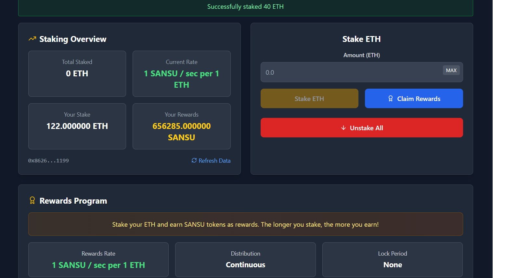

### ✅ `README.md`


# 🌾 Sansu Staking dApp

A clean and responsive Ethereum staking dashboard built with **React**, **TypeScript**, and **Wagmi v2**, allowing users to stake ETH and earn **SANSU** tokens as rewards at a live rate.



---

## ✨ Features

- 🔐 Wallet connection (MetaMask, WalletConnect, etc.)
- 🪙 ETH staking system
- ⚡ Real-time reward rate: `1 SANSU / sec per 1 ETH`
- 📈 Live balance, staked amount, and reward claim interface
- 🌒 Full dark mode UI with Tailwind CSS
- 🔌 Built using **wagmi v2**, **ethers.js**, and **React Query**

---

## 🧠 Tech Stack

- **React** + **TypeScript**
- **Tailwind CSS** – for styling
- **wagmi v2** – wallet integration
- **viem** – interaction with contracts
- **React Query** – for async data management
- **Hardhat** – for contract development/testing

---

## 🛠 Setup Instructions

### 1. Clone the repository

```bash
git clone https://github.com/your-username/sansu-staking.git
cd sansu-staking
```

### 2. Install dependencies

```bash
npm install
```

### 3. Configure the network

Update your `wagmi` config and contracts in:

- `src/config.ts`
- `src/abis/` folder for ABIs
- Set the right contract addresses in the config file

### 4. Start the app

```bash
npm run dev
```

App will be available at: [http://localhost:5173](http://localhost:5173)

---

## 📷 Preview


---

